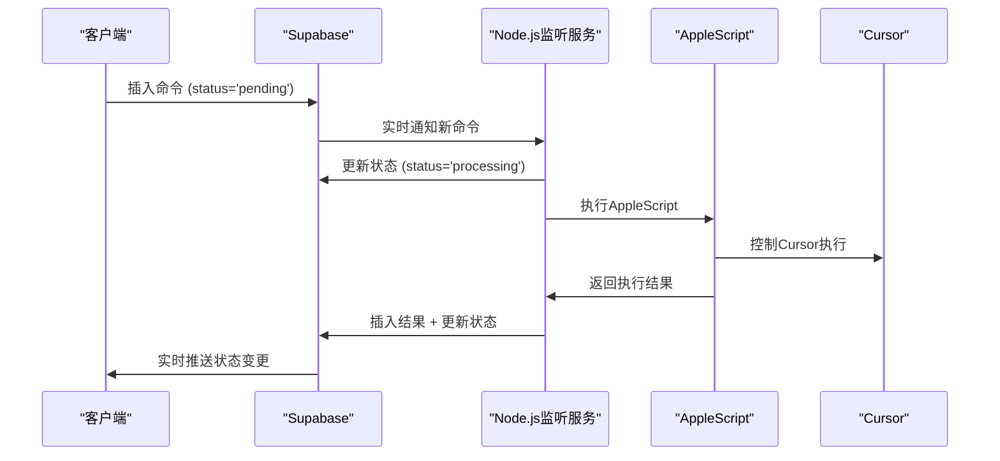

# Cursor远程控制项目
> 基于 Supabase 的无服务器远程控制解决方案，通过手机远程控制 Cursor 应用。

[](https://github.com/terryso/cursor_remote/stargazers)
[](https://github.com/terryso/cursor_remote/pulls)
[](https://opensource.org/licenses/MIT)
[](https://deepwiki.com/terryso/cursor_remote)

[Read this in English](README.en.md)

## 🏗️ 架构升级说明
**重要变更**: 项目已完成**从Redis到Supabase的完整迁移**，实现了完全基于Supabase的无服务器架构，系统更加安全、简洁和稳定。

📖 **完整文档**: 查看 [完整架构文档](docs/COMPLETE_ARCHITECTURE.md) 了解新架构的详细设计。

📚 **文档导航**: 查看 [文档中心](docs/README.md) 了解完整的文档结构和组织。

📋 **需求文档**: 查看 [需求文档中心](docs/requirements/README.md) 了解完整的产品需求、用户故事和技术规范。

## 🚨 快速开始
如果您是第一次设置此项目：

### 📚 理解项目
1. **项目背景**: 阅读 [需求文档导航](docs/requirements/README.md) 了解项目背景和目标
2. **架构概览**: 阅读 [完整架构文档](docs/COMPLETE_ARCHITECTURE.md) 理解系统设计
3. **技术实施**: 查看 [用户故事和史诗分解](docs/requirements/USER_STORIES.md) 了解功能实现

### ⚙️ 环境配置
1. **数据库设置**: 按照 [数据库设置指南](docs/deployment/SETUP_DATABASE.md) 配置Supabase数据库
2. **部署状态**: 查看 [部署状态](docs/deployment/DEPLOYMENT_STATUS.md) 了解当前配置
3. **测试验证**: 参考 [浏览器测试指南](docs/testing/BROWSER_TEST_GUIDE.md) 验证功能

## Demo 体验
[https://cursor-remote.vercel.app/](https://cursor-remote.vercel.app/)

### 🔍 **新功能：集成多种 MCP 服务**
Demo服务器已集成多种MCP功能，您可以直接测试各种能力！

#### 🔍 Tavily 搜索服务
**测试建议**：
- 尝试询问："2025年全球AI发展的最新趋势和突破"
- 或者："量子计算在金融行业的应用案例和效果分析"
- 或者："ChatGPT-5的主要技术突破和与前代产品的区别"

#### 🐍 Python 代码执行服务
**测试建议**：
- 尝试询问："帮我生成一个计算圆的面积的python函数，并通过execute_code工具执行半径为10厘米的圆的面积"
  
- 或者："用Python生成一个斐波那契数列的前20项并执行"
  

系统会自动使用相应的MCP服务获取最新信息或执行代码并返回结果。

## 演示视频 🎬
> 远程控制 Cursor 进行UI自动化测试

[](https://youtu.be/3SWj7X-4Gzs)

## ✨ 主要功能

### 🎮 远程控制
- **命令发送**: 通过手机发送文本命令到 Cursor/VS Code
- **智能建议**: 基于历史记录的命令自动补全
- **实时反馈**: 命令执行状态实时显示

### 📊 系统监控
- **连接状态**: 实时显示 Supabase 连接状态
- **系统指标**: CPU、内存使用率监控
- **性能分析**: 响应时间和成功率统计

### 📝 历史管理
- **命令历史**: 查看和管理所有历史命令
- **搜索过滤**: 快速搜索特定的历史命令
- **删除功能**: 清理不需要的历史记录

### 🔧 诊断工具
- **连接测试**: 一键检测 Supabase 连接问题
- **状态仪表盘**: 多标签页显示详细系统信息
- **错误诊断**: 自动检测并提供解决方案

## 🏗️ 新架构特性

### 完全基于Supabase的无服务器设计
- **纯Supabase BaaS**: 无需Express服务器，降低部署复杂度
- **实时数据同步**: 基于PostgreSQL的原生实时订阅
- **自动API生成**: Supabase自动生成REST API和RPC函数
- **行级安全**: 内置的安全策略和权限控制

### 优化的数据流
```
手机客户端 → Supabase云端 → Node.js监听服务 → AppleScript → Cursor
```

### 迁移成果
✅ **安全性提升** - 解决Redis公网暴露问题  
✅ **架构简化** - 去除Express依赖，纯Supabase实现  
✅ **功能完整** - 29个用户故事全部完成（4个史诗）  
✅ **文档完善** - 完整的需求、架构和技术文档  

## 一键部署到 Vercel (客户端)

[](https://vercel.com/new/clone?repository-url=https%3A%2F%2Fgithub.com%2Fterryso%2Fcursor_remote&env=SUPABASE_URL,SUPABASE_ANON_KEY&envDescription=SUPABASE_URL%20is%20your%20Supabase%20project%20URL.%20SUPABASE_ANON_KEY%20is%20your%20Supabase%20project%20anon%20key.&project-name=cursor-remote-client&repository-name=cursor-remote-client)

点击上面的按钮将 **客户端** 项目部署到 Vercel。您需要为客户端提供以下环境变量：

- `SUPABASE_URL`: 您的 Supabase 项目 URL
- `SUPABASE_ANON_KEY`: 您的 Supabase 项目公开匿名密钥

## 项目结构

```plaintext
CursorRemote/
├── client/                     # 前端应用（纯JavaScript）
│   ├── index.html              # 主界面
│   ├── app.js                  # 核心应用逻辑
│   ├── enhancement.js          # 增强功能模块
│   ├── systemMonitor.js        # 系统监控
│   └── styles.css              # 样式文件
├── server/                     # 轻量级监听服务
│   ├── src/services/
│   │   └── supabaseService.js  # Supabase监听服务
│   ├── auto-restart.js         # 自动重启机制
│   └── connection-monitor.js   # 连接监控
├── database/                   # 数据库配置
│   ├── tables.sql              # 表结构定义
│   └── functions.sql           # RPC函数定义
├── docs/                       # 📚 完整项目文档
│   ├── README.md               # 文档导航中心
│   ├── COMPLETE_ARCHITECTURE.md  # 完整架构文档
│   ├── ROADMAP_2025.md         # 2025功能路线图
│   ├── auto-restart-guide.md   # 自动重启指南
│   ├── requirements/           # 📋 需求文档体系
│   │   ├── README.md          # 需求文档导航
│   │   ├── PRODUCT_REQUIREMENTS.md  # 产品需求文档
│   │   ├── USER_STORIES.md    # 用户故事 (29个故事)
│   │   └── EPICS_BREAKDOWN.md # 史诗技术分解
│   ├── deployment/             # 🚀 部署指南
│   ├── testing/                # 🧪 测试文档
│   └── fixes/                  # 🔧 问题修复记录
├── scripts/                    # AppleScript集成
└── bmad-agent/                 # BMad方法论代理系统
    ├── personas/               # 代理人格配置
    ├── tasks/                  # 任务定义
    ├── templates/              # 文档模板
    └── data/                   # 知识库数据
```

### 📋 文档组织亮点
- **requirements/** - 完整的需求文档体系，包含产品需求、用户故事和技术分解
- **COMPLETE_ARCHITECTURE.md** - 16个章节的comprehensive架构文档
- **角色导向** - 针对不同角色（PM、架构师、开发者、测试）提供专门的阅读指南
- **标准化格式** - 统一的文档格式和版本控制

### 关键架构变更
- **✅ 完全去除Express依赖** - 客户端直接调用Supabase API和RPC函数
- **✅ 轻量级Node.js服务** - 仅作为监听服务，无HTTP服务器
- **✅ 数据库驱动架构** - 所有业务逻辑通过Supabase函数实现
- **✅ 简化部署模式** - 前端静态部署，后端轻量级本地服务

## 重要前提条件

- **操作系统**: 此解决方案仅在 **macOS** 上经过测试和支持
- **目标应用程序**: 您的 Mac 上必须已安装 **Cursor** 或 **Visual Studio Code**
- **运行状态**: AppleScript 需要目标编辑器处于运行状态
- **快捷键配置**: 确保以下快捷键可用：
    - Agent 模式 (Cursor): `⌘+I`
    - Chat 模式 (Cursor): `⌘+K` 或 `⌘+⇧+K`
    - VS Code: 需要配置 GitHub Copilot Chat 快捷键

## Supabase 数据库配置

⚠️ **重要提示**: 请按照 [数据库设置指南](docs/deployment/SETUP_DATABASE.md) 完成Supabase数据库的详细配置，包括：
- 创建必要的数据表 (`commands`, `results`, `user_favorites`, `command_templates`)
- 配置RPC函数 (分析、历史、模板管理等)
- 设置Realtime订阅
- 配置RLS (Row Level Security) 策略

### 新增数据表
```sql
-- 用户收藏命令
CREATE TABLE user_favorites (
    id UUID DEFAULT gen_random_uuid() PRIMARY KEY,
    command_text TEXT NOT NULL,
    category VARCHAR(50),
    description TEXT,
    usage_count INTEGER DEFAULT 0
);

-- 命令模板
CREATE TABLE command_templates (
    id UUID DEFAULT gen_random_uuid() PRIMARY KEY,
    name VARCHAR(100) NOT NULL,
    template_text TEXT NOT NULL,
    category VARCHAR(50),
    variables JSONB,
    usage_count INTEGER DEFAULT 0
);
```

## Cursor MCP 配置 (增强功能支持)

为了获得完整的功能体验，建议在 Cursor 的 MCP 设置中配置以下服务：

### 基础配置 - Supabase 结果返回
```json
{
  "mcpServers": {
    "supabase": {
      "command": "npx",
      "args": [
        "-y",
        "@supabase/mcp-server-supabase@latest",
        "--access-token",
        "your-supabase-access-token"
      ]
    }
  }
}
```

### 增强配置 - 多种MCP服务
```json
{
  "mcpServers": {
    "supabase": {
      "command": "npx",
      "args": [
        "-y",
        "@supabase/mcp-server-supabase@latest",
        "--access-token",
        "your-supabase-access-token"
      ]
    },
    "tavily": {
      "command": "npx",
      "args": [
        "-y",
        "@tavily/mcp-server@latest"
      ],
      "env": {
        "TAVILY_API_KEY": "your-tavily-api-key"
      }
    },
    "python": {
      "command": "npx",
      "args": [
        "-y",
        "@modelcontextprotocol/server-python@latest"
      ]
    }
  }
}
```

**配置说明**: 
- **Supabase MCP**: 用于将命令执行结果写回数据库
- **Tavily MCP**: 提供实时搜索功能，需要 [Tavily API Key](https://tavily.com/)
- **Python MCP**: 支持Python代码执行和分析
- 将 `"your-supabase-access-token"` 替换为您的 [Supabase 访问令牌](https://supabase.com/dashboard/account/tokens)
- 将 `"your-tavily-api-key"` 替换为您的 Tavily API 密钥

## 🚀 功能路线图

查看我们的 [2025年功能路线图](docs/ROADMAP_2025.md) 了解项目发展计划：

### 短期目标 (1-3个月)
- 🎨 用户体验优化 (文件上传、快捷命令)
- 🤖 智能AI助手集成 (多AI引擎支持)
- 🎮 深度编辑器集成 (文件系统操作)

### 中期目标 (3-6个月)
- 👥 多用户支持与认证
- 📱 PWA与离线支持
- 🔧 会话管理系统

### 长期目标 (6个月以上)
- 🌐 跨平台编辑器支持 (JetBrains系列)
- 🔌 插件系统架构
- 🏢 企业级功能

## 安装与使用

### 服务器端

1. 进入服务器目录并安装依赖:
    ```bash
    cd server && npm install
    ```

2. 配置环境变量:
    在项目根目录创建 `.env` 文件:
    ```env
    SUPABASE_URL=https://your-project-id.supabase.co
    SUPABASE_SERVICE_KEY=your-supabase-service-role-key
    DEFAULT_EDITOR=Cursor
    ```

3. 启动监听服务:
    ```bash
    # 开发模式（自动重启）
    npm run dev
    
    # 生产模式（带自动重启监控）
    npm run production
    
    # 手动启动
    npm start
    ```

### 客户端

1. **通过 Vercel 部署 (推荐)**:
    - 点击上方的 "Deploy with Vercel" 按钮
    - 配置 `SUPABASE_URL` 和 `SUPABASE_ANON_KEY` 环境变量

2. **本地运行**:
    - 修改 `client/env-config.js` 配置文件
    - 使用静态文件服务器运行: `npx serve client/`

## 工作原理

### 核心架构流程


### 新架构优势
- **减少延迟**: 客户端直接与Supabase交互
- **提高稳定性**: 无单点故障，Supabase提供高可用性
- **简化部署**: 前端静态部署，后端轻量级服务
- **自动扩展**: Supabase自动处理负载和扩展

## 📚 文档和维护

### 🎯 核心文档导航

#### 📋 需求和设计文档
- [📖 需求文档中心](docs/requirements/README.md) - 需求文档导航和使用指南
- [📐 完整架构文档](docs/COMPLETE_ARCHITECTURE.md) - 系统架构设计蓝图（16个章节）
- [📋 产品需求文档](docs/requirements/PRODUCT_REQUIREMENTS.md) - 完整的产品需求规范
- [📝 用户故事文档](docs/requirements/USER_STORIES.md) - 29个用户故事和4个史诗
- [🔧 史诗技术分解](docs/requirements/EPICS_BREAKDOWN.md) - 详细的技术实施方案

#### 🚀 部署和运维文档
- [🚀 数据库设置指南](docs/deployment/SETUP_DATABASE.md) - Supabase配置详细说明
- [📊 部署状态文档](docs/deployment/DEPLOYMENT_STATUS.md) - 当前部署状态和配置
- [🔄 自动重启指南](docs/auto-restart-guide.md) - 服务监控和自动重启
- [🧪 浏览器测试指南](docs/testing/BROWSER_TEST_GUIDE.md) - 功能测试方法

#### 🔧 技术支持文档
- [📚 文档组织说明](docs/README.md) - 完整的文档结构和使用指南
- [🚀 2025功能路线图](docs/ROADMAP_2025.md) - 项目发展规划
- [🔧 问题修复记录](docs/fixes/) - 技术问题解决方案集合

### 🎭 角色导向的文档使用指南

#### 👔 项目经理/产品经理
1. [需求文档导航](docs/requirements/README.md) → [产品需求文档](docs/requirements/PRODUCT_REQUIREMENTS.md) → [用户故事](docs/requirements/USER_STORIES.md)

#### 🏗️ 技术架构师/开发负责人
1. [完整架构文档](docs/COMPLETE_ARCHITECTURE.md) → [史诗技术分解](docs/requirements/EPICS_BREAKDOWN.md) → [部署指南](docs/deployment/)

#### 💻 开发工程师
1. [史诗技术分解](docs/requirements/EPICS_BREAKDOWN.md) → [架构文档](docs/COMPLETE_ARCHITECTURE.md) → [用户故事](docs/requirements/USER_STORIES.md)

#### 🧪 测试工程师
1. [用户故事验收标准](docs/requirements/USER_STORIES.md) → [测试指南](docs/testing/) → [史诗分解](docs/requirements/EPICS_BREAKDOWN.md)

### 🔄 维护工具和机制
项目包含完善的监控和维护机制：
- **自动重启**: `npm run production` 启动带监控的服务
- **连接监控**: 实时监控Supabase连接状态
- **故障恢复**: 自动检测和修复卡住的命令
- **性能分析**: 内置的系统指标收集和展示

## ⭐ Star History

[](https://www.star-history.com/#terryso/cursor_remote&Date)

## License

本项目根据 [MIT License](LICENSE) 授权。

---

*🎯 追求简洁高效的远程控制体验！基于BMad方法论的增量式架构设计完成*
